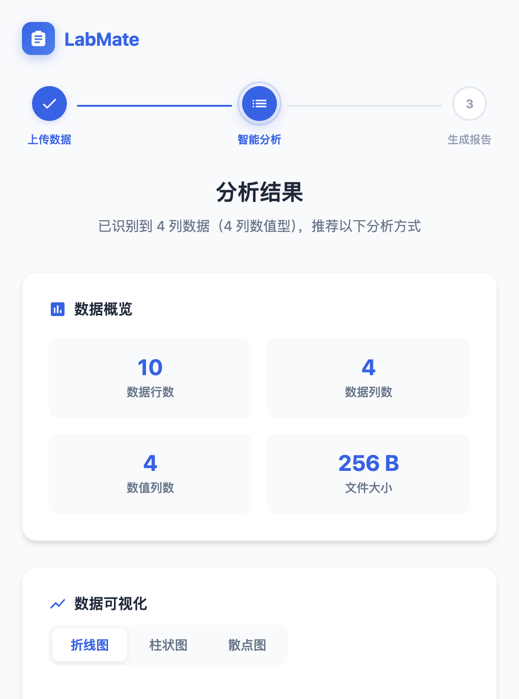
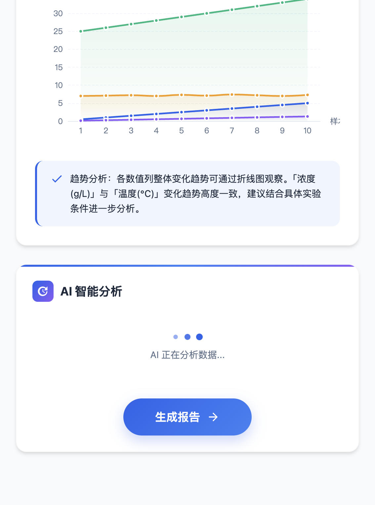
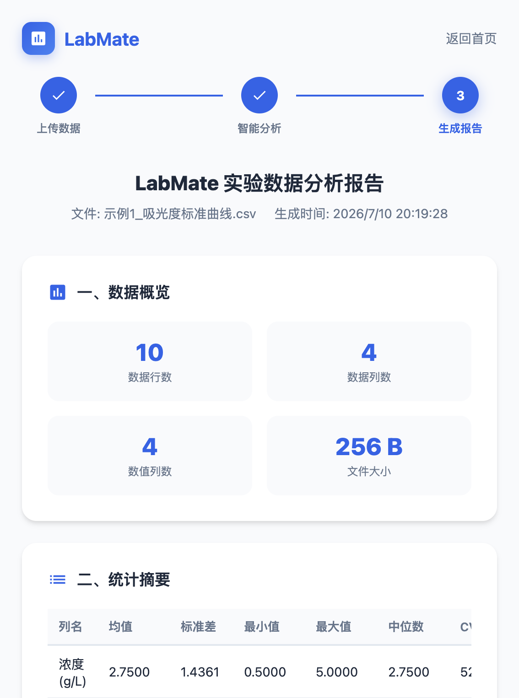
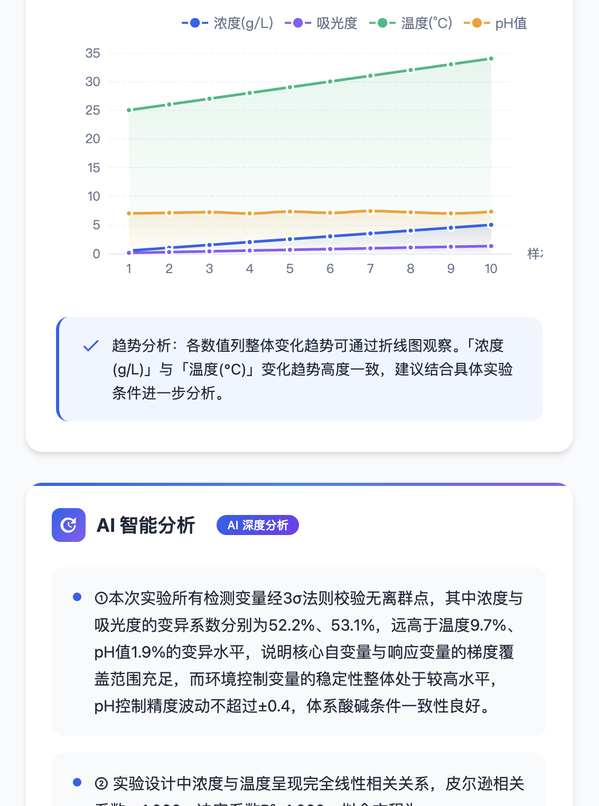

# LabMate：大学生的 AI 实验数据分析助手

> 上传 Excel，3 分钟从数据到 PDF 报告，AI 帮你写分析结论

## 一、产品简介

**LabMate** 是一款面向理工科大学生的实验数据分析工具。

**核心流程：** 上传实验数据（Excel/CSV）→ 统计引擎自动分析 + AI 生成结论 → 一键导出 PDF 报告

**目标用户：** 材料、化学、生物等专业做实验的大学生

**技术栈：** 纯前端 HTML/CSS/JS + SheetJS（Excel解析）+ ECharts 5.4（4种图表）+ 豆包大模型 API（AI分析，实验类型识别+领域知识注入）+ html2pdf.js（PDF导出）

**核心功能：**
- 数据上传：支持 Excel/CSV 拖拽上传，多 Sheet 自动识别，数据预览表格
- 4 种图表：折线图、柱状图、散点图（含回归线）、箱线图（含离群点标注）
- 统计引擎：Pearson 相关系数、线性回归（R²）、3σ 离群点检测、描述性统计
- AI 深度分析：实验类型识别（标准曲线/酶动力学/pH活性/温度效应/多因素）、推荐分析方法、数据质量评估、实验建议
- 实验模板库：4 种常用实验模板一键加载
- 报告导出：一键生成 PDF 实验报告

**在线体验：** https://gashen0.github.io/labmate/

---

## 二、痛点与灵感

作为一个做过无数实验的大学生，我太了解这个流程有多痛苦：

1. 实验做完，面对几十上百行数据，不知道从哪开始分析
2. 想画个标准曲线，在 Excel 里调图表格式就要花半小时
3. 不知道该用相关分析还是回归分析，统计方法选不对
4. 实验报告不知道怎么写，凑字数又怕不专业
5. 导师催得紧，从数据到报告往往要花一整个晚上

**LabMate 就是为了解决这个痛点。**

| 对比 | Excel | Origin | LabMate |
|------|-------|--------|---------|
| 上手门槛 | 中等 | 高 | **低** |
| AI 分析 | 无 | 无 | **豆包大模型驱动** |
| 实验类型识别 | 无 | 无 | **5种自动识别** |
| 一键出报告 | 需手动排版 | 需模板 | **PDF 一键导出** |
| 价格 | ¥748/年 | $850/年 | **免费** |
| 在线使用 | 需安装 | 需安装 | **浏览器即用** |

传统手动分析：Excel画图 30 分钟 + 统计计算 20 分钟 + 写分析结论 1 小时 = 将近 2 小时
LabMate：上传 → 分析 → 导出报告，**大幅缩短分析时间**

---

## 三、AI 能力说明（重点）

LabMate 的 AI 不只是"调个 API 出结论"，而是一个**多层的分析系统**：

### 第一层：实验类型识别（本地数据特征检测）
根据列名关键词和数据结构，自动判断实验类型：
- 标准曲线（浓度/吸光度等关键词）
- 酶动力学（底物浓度/反应速率）
- pH-酶活性曲线（钟形分布检测）
- 温度效应（Arrhenius 方程相关）
- 多因素实验（3+ 数值列检测）
- 变量耦合检测（r≈1.0 警告）

### 第二层：统计引擎（本地算法，零延迟）
- Pearson 相关系数、线性回归（R²）、3σ 离群点检测、描述性统计
- 箱线图五数概括（最小值、Q1、中位数、Q3、最大值）+ IQR 离群点

### 第三层：大模型深度解读（豆包 API）
System Prompt 注入化学/生物学/材料科学领域知识，AI 按结构化格式输出：
1. **实验类型识别** — 判断实验类型并解释依据
2. **推荐分析方法** — 根据实验类型推荐合适的方法论
3. **数据分析** — 引用具体数值做专业解读
4. **数据质量评估** — 评估离群点、耦合度、数据可靠性
5. **实验建议** — 具体的改进方向和下一步操作

### 第四层：降级策略
当 API 不可用时，自动降级到本地统计引擎 + 领域知识规则，保证离线也能用。

---

## 四、技术实现

### 数据流架构
```
upload.html              analysis.html              report.html
   │                         │                         │
   │ FileReader 读取文件     │                         │
   │ SheetJS 解析为 JSON    │                         │
   │ 多Sheet识别 + 预览     │                         │
   │ 存入 localStorage      →│ 统计引擎计算            │
   │                         │ ECharts 4种图表渲染     │
   │                         │ 实验类型识别            │
   │                         │ 调用豆包 API            │
   │                         │ 结构化5段输出+打字机效果│
   │                         │ 存分析结果到 localStorage│
   │                         │                         │
   │                         └────────────────────────→│ 组装报告
   │                                                   │ html2pdf.js 导出 PDF
```

### 关键依赖
- SheetJS 0.18.5 — 浏览器端解析 Excel（多Sheet支持）
- ECharts 5.4.3 — 数据可视化（折线/柱状/散点+/箱线图）
- html2pdf.js 0.10.1 — PDF 导出
- 豆包大模型 API — AI 结构化分析（doubao-seed-2-0-lite-260428）

### API Key 配置说明
AI 分析功能需要配置豆包大模型 API Key：
- 获取方式：登录 [火山引擎 ARK 平台](https://console.volcengine.com/ark) → 创建推理接入点 → 获取 API Key
- 配置方式：在浏览器控制台执行 `localStorage.setItem('labmate_api_key', '你的Key')`
- 不配置 API Key 也可使用全部统计分析和图表功能，AI 分析会自动降级为本地引擎

---

## 五、体验方式

**在线体验：** https://gashen0.github.io/labmate/

**本地体验：**
1. 下载项目文件
2. 双击 index.html 即可使用
3. 或使用实验模板库，无需上传文件即可体验

**示例数据：**
- 标准曲线：分光光度法定量分析（r=0.998）
- 酶动力学：底物浓度-反应速率（Michaelis-Menten）
- pH-酶活性：钟形曲线（最适 pH=7.0）
- 温度效应：Arrhenius 方程相关

---

## 六、TRAE 实践过程

**Session ID：** `6a509384295c18a0a6648cc0`

整个项目在一个 TRAE Session 中完成。这是我第一次用 TRAE 做完整项目，过程大致是这样：

先让 TRAE 帮我理解评审标准的四个维度，然后从首页骨架开始，一步一步搭——首页、上传页、分析页、报告页。骨架搭完后接入 SheetJS 做 Excel 解析，同时写统计引擎（Pearson、线性回归、离群点检测）。

AI 分析是第三步接入的，一开始 AI 只能输出一段话，后来觉得太"薄"了，就让 TRAE 帮我做了实验类型识别和领域知识注入，AI 输出也改成了结构化的 5 段格式。这个改动花的时间最长，因为要反复调 prompt 和前端渲染逻辑。

中间修了不少 Bug。印象最深的是散点图在只有 1 列数值数据时会崩溃，还有中位数在偶数个数据时要取平均但我写成了直接取值。每个 Bug 都是贴报错日志给 TRAE，它直接定位到行修。

后面又补了箱线图、多 Sheet 支持、数据预览、实验模板库这些功能。首页的竞品对比和效率数据是最后加的，因为回头看发现痛点论证不够硬。

最后一步是推到 GitHub Pages 上线，以及写这篇帖子。

### 开发截图


*首页品牌展示 + 效率数据 + 竞品对比*


*拖拽上传 + 多Sheet支持 + 数据预览 + 实验模板库*


*数据概览 + ECharts 4种动态图表*


*AI 结构化5段分析 + 打字机效果 + 实验类型识别*


*完整报告页 + PDF 导出按钮*


*箱线图含离群点标注 + 五数概括*

---

## 七、经验总结

这次开发让我第一次完整体验到"用自然语言驱动代码"：

1. **把需求拆小，TRAE 才能精准命中**：不要一次性说"帮我做个数据分析工具"，而是分步说"先做上传页"→"再写统计引擎"→"再接入 AI API"
2. **遇到报错把日志贴给 TRAE**：散点图单列崩溃、中位数偶数错误、API 除零——每次都是贴日志直接修
3. **让 TRAE 做自己的评委**：每轮迭代后让 TRAE 以评委视角评审，每次都能精准定位短板
4. **多轮迭代比一次完美更重要**：先做出来再改，比一开始就追求完美效率高得多

---

**项目文件：** 见附件 ZIP
**在线体验：** https://gashen0.github.io/labmate/
**TRAE 社区初赛专区**